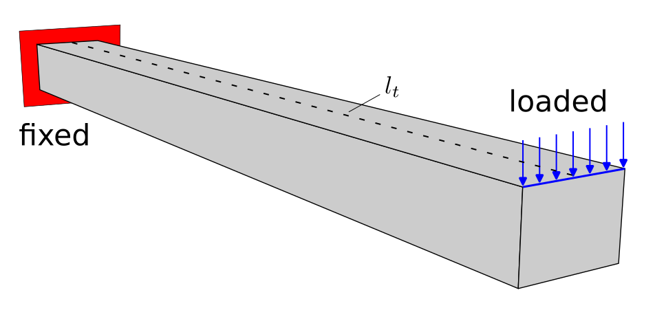
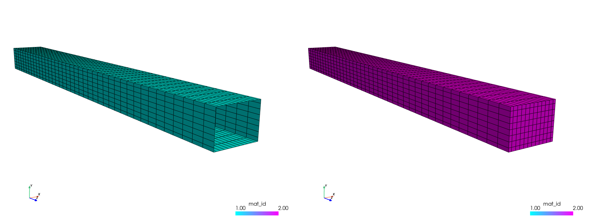
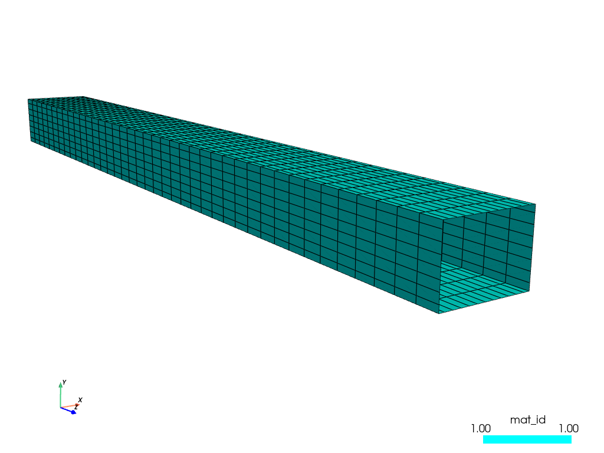
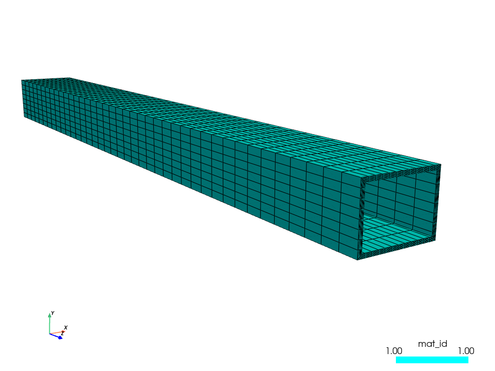
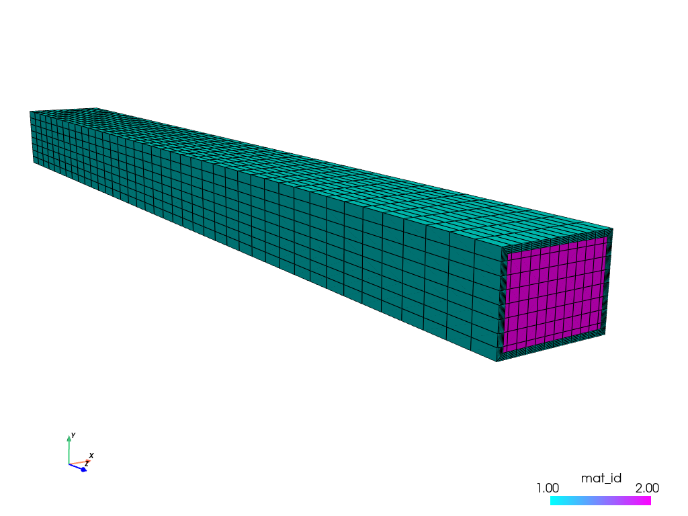
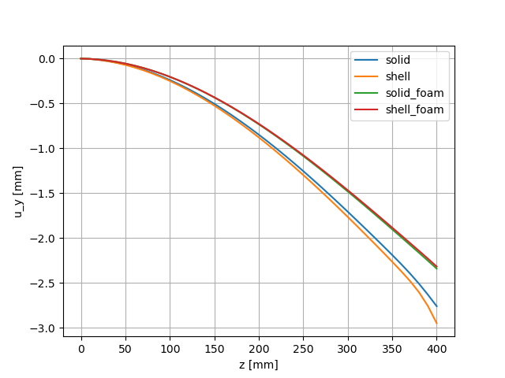

.. toctree::
   :maxdepth: 2
   :caption: Contents:

Deformation of a foam-reinforced shell beam
===========================================

FE Model
--------

We consider a thin-walled beam made of steel fully fixed at its one end and
loaded by a uniform load at the top edge of the second end. The beam is
reinforced by a foam material placed inside it. The outer dimensions of the
beam are 30x40 mm, the wall thickness is 2 mm, and its length is 400 mm. The
thin-walled beam is modelled using
`Shell10XTerm <https://sfepy.org/doc-devel/src/sfepy/terms/terms_shells.html#sfepy.terms.terms_shells.Shell10XTerm>`_
elements and the foam part by the classical linear solid elements. The material properties
of the constituents are summarize in the following table:

.. _tab-mat-prop:

.. csv-table:: Material properties
   :header: "", "Young modulus", "Poisson ration"
   :align: center

   "steel", "210 GPa", "0.3"
   "foam", "20 GPa", "0.25"

The applied boundary conditions are depicted in :numref:`fig-bc`.

.. _fig-bc:

   Boundary conditions applied to the beam.

In order to show the credibility of the above model (see :numref:`fig-model0`),
we compare its results with the results of the following models:

  * beam without reinforcement using Shell10XTerm elements, see :numref:`fig-model1`
  * beam without reinforcement using solid hexahedral elements, see :numref:`fig-model2`
  * beam with reinforcement using solid hexahedral elements for both constituents, see :numref:`fig-model3`

.. _fig-model0:

   Beam with foam reinforcement - Shell10XTerm + hexahedral elements.

.. _fig-model1:

   Beam without reinforcement - Shell10XTerm elements.

.. _fig-model2:

   Beam without reinforcement - solid hexahedral elements.

.. _fig-model3:

   Beam with foam reinforcement - solid hexahedral elements.

Running simulation
------------------

To run the numerical simulation, download the
`archive <https://github.com/sfepy/example_shell_beam/archive/v1.zip>`_,
unpack it and run by:

.. code::

   sfepy-run example_shell_beam-1/beam_shell.py
   sfepy-run example_shell_beam-1/beam_solid.py
   sfepy-run example_shell_beam-1/beam_shell_foam.py
   sfepy-run example_shell_beam-1/beam_solid_foam.py

The finite element meshes can be generated using the :code:`gen_mesh.py` script.

Results
-------

The displacements in the y-direction along line :math:`l_t` (see
:numref:`fig-bc`) obtained by the different models are compared in
:numref:`fig-results`. The figure is plotted by :code:`plot.py`

.. _fig-results:

   Displacements along line :math:`l_1`.
