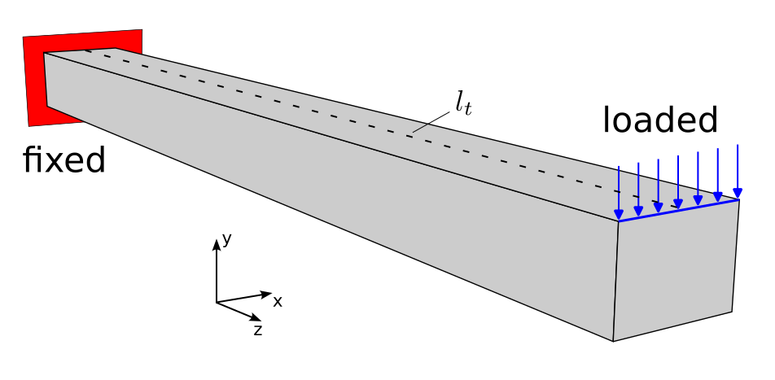

.. toctree::
   :maxdepth: 2
   :caption: Contents:

Deformation of a foam-reinforced shell beam
===========================================

FE Model
--------

We consider a thin-walled beam made of steel fully fixed at its one end and
loaded by a uniform load at the top edge of the second end. The beam is
reinforced by a foam material placed inside it. The outer dimensions of the
beam are 30x40 mm, the wall thickness is 2 mm, and its length is 400 mm. The
thin-walled beam is modeled using `shell10x`_ elements and the foam part by
the classical linear solid elements. The material properties of the
constituents are summarized in the following table:

.. _tab-mat-prop:

.. csv-table:: Material properties
   :header: "", "Young modulus", "Poisson ration"
   :align: center

   "steel", "210 GPa", "0.3"
   "foam", "20 GPa", "0.25"

The applied boundary conditions are depicted in :numref:`fig-bc`.

.. _fig-bc:

   Boundary conditions applied to the beam.

In order to show the credibility of the above model (see :numref:`fig-model0`),
we compare its results with the results of the following models:

  * beam without reinforcement using `shell10x`_ elements, see :numref:`fig-model1`
  * beam without reinforcement using solid hexahedral elements, see :numref:`fig-model2`
  * beam with reinforcement using solid hexahedral elements for both the constituents, see :numref:`fig-model3`

.. _fig-model0:

.. figure:: _static/beam_shell_foam_2.png
   :width: 700px
   :align: center
   :figclass: align-center

   Beam with foam reinforcement - `shell10x`_ + hexahedral elements.

.. _fig-model1:

.. figure:: _static/beam_shell_2.png
   :width: 400px
   :align: center
   :figclass: align-center

   Beam without reinforcement - `shell10x`_ elements.

.. _fig-model2:

.. figure:: _static/beam_solid_2.png
   :width: 400px
   :align: center
   :figclass: align-center

   Beam without reinforcement - solid hexahedral elements.

.. _fig-model3:

   Beam with foam reinforcement - solid hexahedral elements.

Running simulation
------------------

To run the numerical simulation, download the
`archive <https://github.com/sfepy/example_shell_beam/archive/v1.zip>`_,
unpack it and run by:

.. code::

   sfepy-run example_shell_beam-1/beam_shell.py
   sfepy-run example_shell_beam-1/beam_solid.py
   sfepy-run example_shell_beam-1/beam_shell_foam.py
   sfepy-run example_shell_beam-1/beam_solid_foam.py

The finite element meshes can be generated using the :code:`gen_mesh.py` script.

Results
-------

To plot the deformed foam-reinforced structure run the following command:

.. code::

   sfepy-view results/beam_shell_foam.vtk -f uf:wuf:f10:m2:p0 0:vw:m2:p0 us_disp:wus_disp:f10:m1:p1 --camera-position="-0.4,0.16,0.57,0.02,0,0.23,0.22,0.97,-0.11" --grid-vector1="0, 1.6, 0"

The resulting image is depicted in :numref:`fig-displ`.

.. _fig-displ:

   Resulting displacements.

The displacements in the y-direction along line :math:`l_t` (see
:numref:`fig-bc`) obtained by the different models are compared in
:numref:`fig-results`. The figure is plotted by :code:`plot.py`

.. _fig-results:

   Displacements along line :math:`l_1`.

.. _shell10x: https://sfepy.org/doc-devel/src/sfepy/terms/terms_shells.html#sfepy.terms.terms_shells.Shell10XTerm
